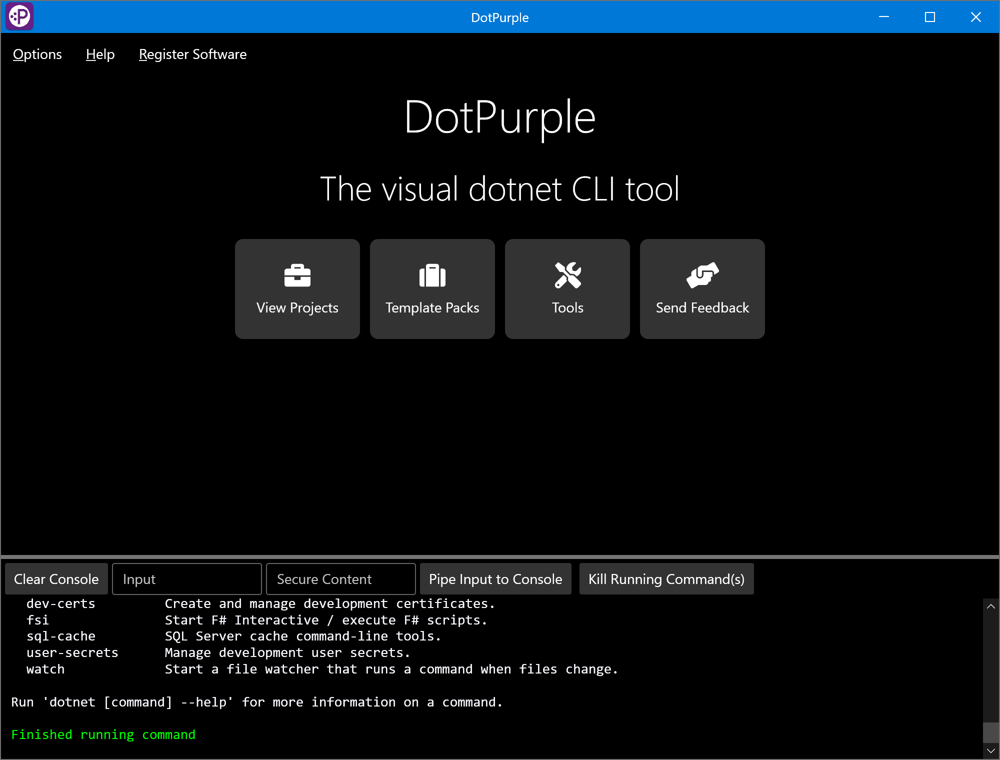
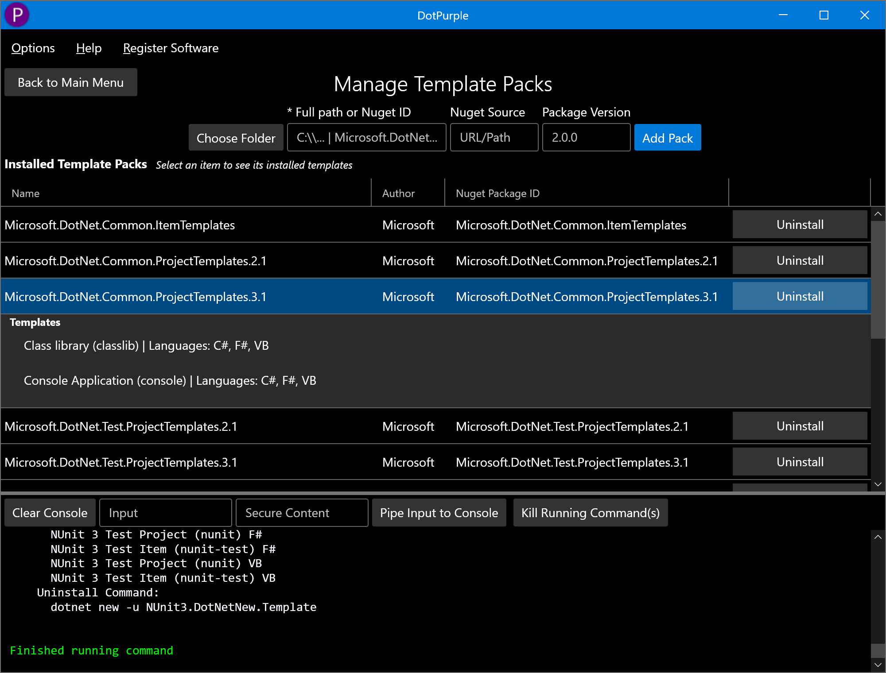
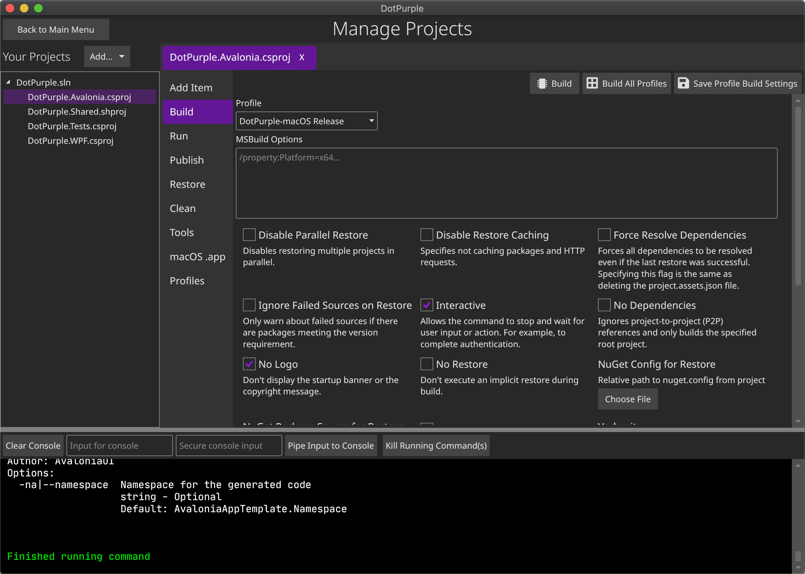

# DotPurple

DotPurple is a cross-platform GUI for the .NET (`dotnet`) command-line interface (CLI) available for Windows, macOS, and Linux. Build, publish, run, and manage all of your .NET Core 3+ and .NET 5 projects and tools in just a few clicks without ever typing a `dotnet` command!

DotPurple helps you learn the .NET Core 3+ and .NET 5 CLI by providing an intuitive GUI for managing projects, templates, and tools. Taking advantage of the many options that the `dotnet` CLI provides are only a few clicks away.

DotPurple removes the annoyance of manually parsing the myriad of `dotnet` CLI options by providing an intuitive GUI that makes managing your .NET projects quick and easy. Build, run, clean, publish, and manage all of your projects, templates, and tools without the need to remember all needed CLI options every time.

This repo holds bug reports and feature requests for the DotPurple software. Please file bug reports or feature requests under [issues](https://github.com/DotPurpleApp/DotPurple-Issues/issues)! You can also request new tools to show up in the browsable 'dotnet' tool list, which shows up in v1.3 or greater. A browsable 'dotnet' template list shows up in v1.7 or greater. Thanks for your support!

## Screenshots

